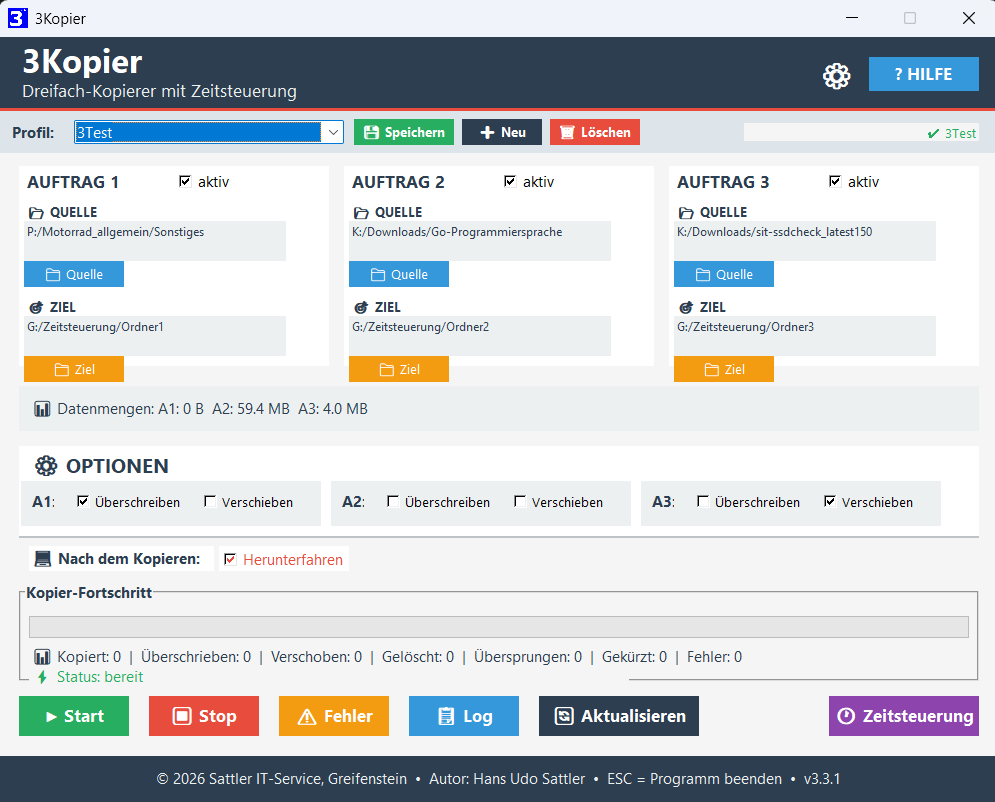

# S-IT-3Kopier

**Portabler Dreifach-Kopierer mit Profilen und Protokoll für Windows**

Bis zu drei unabhängige Kopier- oder Verschiebe-Aufträge in einem einzigen Durchlauf –
ideal zum Verteilen von Dateien auf NAS-Laufwerke, USB-Sticks oder Cloud-Verzeichnisse.

---

---

## Features

- 📋 **Drei Aufträge** – Quelle, Ziel und Optionen je Auftrag unabhängig konfigurierbar
- ⚙️ **Optionen pro Auftrag** – Überschreiben (immer oder nur wenn neuer) und Verschieben
- 💾 **Profile** – Konfigurationen als `.3ko`-Dateien speichern und per Klick laden
- 📊 **Fortschritt & Statistik** – Fortschrittsbalken, Restzeit-Schätzung, Protokolldateien
- 💻 **Herunterfahren** – optional nach fehlerfreiem Abschluss
- 🔄 **Einstellungen merken** – alle Pfade und Optionen werden beim Beenden gespeichert

## Download

➡️ **[Aktuelle Version herunterladen](https://github.com/SattlerIT/sit-3kopier/releases)**

ZIP entpacken – kein Installer erforderlich. Läuft direkt aus dem Verzeichnis oder vom USB-Stick.

## Systemanforderungen

- Windows 10 / Windows 11 (64-Bit)
- Keine Administratorrechte erforderlich
- Keine Installation – ZIP entpacken und starten

## Weitere Informationen

📄 **[Zur Projektseite](https://sattlerit.github.io/sit-3kopier/)**

## Sicherheitshinweis

Windows SmartScreen oder Virenscanner können die EXE beim ersten Start als unbekannt einstufen.
Bitte als vertrauenswürdig bzw. Ausnahme hinzufügen.
Alle Dateien stammen ausschließlich von **Sattler IT-Service** über diese GitHub-Seite.

## Spende / Donate

Die S-IT-Tools werden kostenlos entwickelt und gepflegt.
Eine kleine Spende hilft dabei, die Entwicklung fortzuführen – herzlichen Dank! 🙏

---

© 2026 Hans Udo Sattler · Sattler IT-Service, Greifenstein
