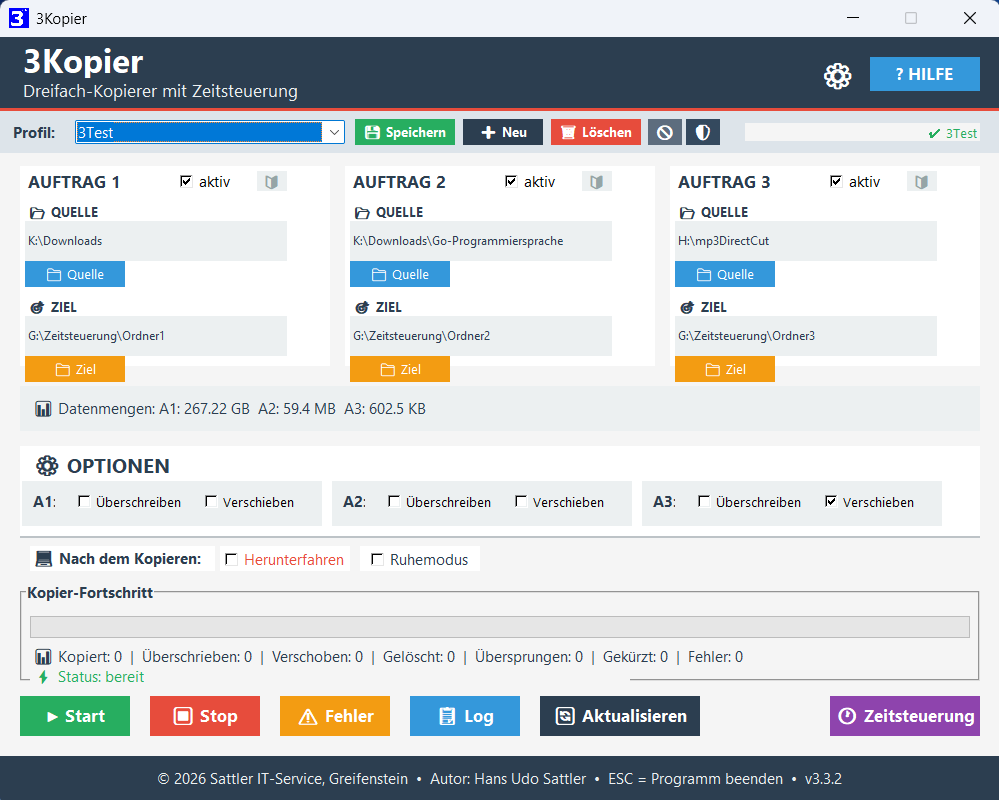

# S-IT-3Kopier

**Portable triple copy tool with profiles, logging and a scheduler — for Windows**

Up to three independent copy or move jobs in a single run — ideal for distributing files
to NAS drives, USB sticks or cloud folders. On top of that, any number of profiles can
run automatically in the background on a schedule, which means the number of automated
copy tasks is effectively unlimited.

🇩🇪 **[Diese Seite auf Deutsch](README_DE.md)**

---

---

## Eighteen languages

The interface, all dialogs, the scheduler, the logs and the help pages are available in
**German, English, French, Spanish, Dutch, Italian, Croatian, Slovenian, Serbian, Bosnian,
Montenegrin, Bulgarian, Macedonian, Albanian, Romanian, Turkish, Polish and Danish**. The
language is chosen during installation and can be changed at any time under ⚙. The program
name changes with it: 3Kopier, 3Copy, 3Copier, 3Copiar, 3Kopieer, 3Copia, 3Kopiraj,
3Copiază, 3Kopyala, 3Kopiuj.

File names and settings stay the same in every language (`3Kopier.ini`, profiles as
`.3ko`, folder `Logs`), so switching language leaves your profiles, filters and settings
untouched.

## A tidy program folder

Language files, help pages, settings and profiles each live in a folder of their own —
`Lang`, `Help`, `Config` and `Profile`. Only the program itself and `_internal` remain at
the top. An existing installation sorts itself out on first start; nothing needs to be
moved by hand.

## Features

- 📋 **Three jobs** — source, target and options configurable independently for each job
- ⚙️ **Options per job** — overwrite (always or only if newer) and move
- 💾 **Profiles** — save configurations as `.3ko` files; picking one from the list loads it straight away
- 📊 **Block-wise copying and real progress** — the progress bar keeps moving even inside a single large file, and "Stop" takes effect immediately
- 🕐 **Scheduler** — run profiles in the background on a schedule (daily, on selected weekdays or at an interval)
- 🔇 **Silent mode** — automatic runs without any window at all; a message appears only on real errors
- 🗔 **Separate run window** — the main window stays untouched while a scheduled run is in progress
- 📌 **Tray and autostart** — keeps running in the background while a schedule is active, and starts with Windows when needed
- 🖥 **Scalable interface** — fixed steps from 90 % to 200 %, adjustable log retention
- 💻 **Shut down** — optional, after a run that finished without errors
- 🔄 **Settings remembered** — all paths and options are stored when the program closes

## Download

➡️ **[Download the current version](https://github.com/SattlerIT/sit-3kopier/releases)**

Unpack the ZIP — no installer required. Runs straight from the folder or from a USB stick.
A setup version is available as well if you prefer an entry in the Windows program list.

## System requirements

- Windows 10 / Windows 11 (64-bit)
- No administrator rights required
- No installation — unpack the ZIP and start

## More information

📄 **[Project page](https://sattlerit.github.io/sit-3kopier/)**

## Security note

Windows SmartScreen or virus scanners may flag the EXE as unknown on first launch.
Please mark it as trusted or add an exception.
All files come exclusively from **Sattler IT-Service** via this GitHub page.

## Donate

The S-IT tools are developed and maintained free of charge.
A small donation helps to keep the work going — thank you! 🙏

---

© 2026 Hans Udo Sattler · Sattler IT-Service, Greifenstein
